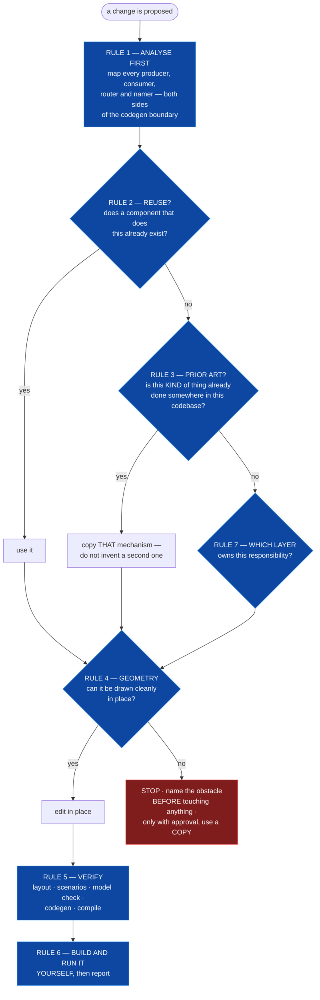
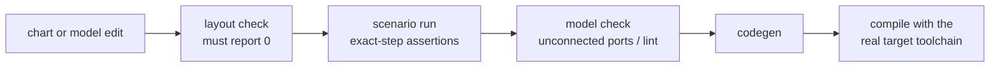

# Model-Based Design Change Discipline

Seven rules for changing a production Simulink/Stateflow model that other code is generated from.
They are process rules, not modelling tutorials — they say *what to do before, around and after*
an edit, whatever performs it: the Simulink/Stateflow API from a MATLAB session, a MATLAB MCP
server, or hand edits in the editor.

Nothing here is specific to one assistant or IDE. If your agent can run MATLAB commands and read
this file, the rules apply.

Each rule exists because skipping it produces a specific, recurring class of defect. Those defect
classes are named under each rule, because a rule without its failure mode gets rationalised away.

**Scope.** Anything that edits a `.slx`, a data dictionary, a chart, or the C that is generated
from them. Applies equally to a one-line guard edit and a new subsystem.

**Prerequisite.** These rules govern *how* you change a model, not how to drive the tooling. Use
them alongside whatever performs the change — MathWorks' own model-building guidance, a
`model_edit`-style API, or direct Simulink API calls. They do not replace it.

---

## The gate

Run this before any model edit. Every branch that says STOP means stop and say so — do not
proceed and explain afterwards.

---

## Rule 1 — analyse every dependency before starting

Not "the file I am editing". Every place that **produces**, **consumes**, **routes** or **names**
the thing being changed — including the far side of the codegen boundary, where nothing is
type-checked for you.

> **Failure mode: the partial delete.** A command id is removed from one chart. Three other places
> still produce or accept it: a second chart still emits the id, a selector still admits it into a
> queue slot, and the constant is still defined in both charts. Result — a request fills a slot that
> nothing can ever free, and after a few of them the queue is dead until reboot. One deletion, four
> places.

Before any edit, answer all six:

| Ask | Where to look |
|---|---|
| who **writes** this value? | the RTE/glue layer, every chart, other feature models |
| who **reads** it? | every chart, top-model wiring, the glue layer after the step |
| is the name **duplicated**? | every data dictionary, the hand-written enum, any parser key table |
| does a **port count** change? | re-verify every model-reference connection **by name** — Simulink silently re-attaches lines **by position** |
| does it need a **new generated file**? | hand-maintained build lists (CMakeLists, makefiles) do not learn about it |
| is this value **persisted**? | NVM/config schema, defaults, migration for devices already in the field |

Full checklist and the hand-synced-contract table: `references/dependency-checklist.md`.

---

## Rule 2 — reuse before you build

Search for an existing component before writing one. Mature model repos contain far more than they
look like: provisioning flows, senders, event catalogues, counter stores, response encoders,
payload generators, bounded-array config patterns.

**Do this literally:** grep the model repo and the C repo for the *verb* (`send`, `retry`,
`debounce`, `encode`, `persist`) before proposing a new block, chart or module.

Enabling a catalogue entry that already exists is not "reuse-flavoured" — it is the whole job done.

---

## Rule 3 — follow the mechanism that already exists

If the codebase already does *this kind of thing* in a particular way, the new work uses **that
same way**. Do not introduce a second mechanism for a problem that already has one.

> **Failure mode: the second mechanism.** Every other feature model in a repo received its job the
> same way — the glue layer parses the payload into a **level that stands**, and the model triggers
> on data plus an availability bit that arrive together. One new feature instead invented a
> **one-step pulse** that was cleared after every step. The pulse was gone by the time the data
> arrived, so the intake had to remember the previous step and compare a 65-byte id — and an array
> compare is impossible in the C action language, which forced a MATLAB Function block and a
> generated helper `.c` that then had to be hand-added to the build list. A whole extra mechanism,
> a whole extra file, and a two-step pairing problem — none of which the existing pattern needs.

**Before adding any new mechanism, answer in writing:** *how does <existing feature A> / <existing
feature B> do this today, and why can that not be used here?* If there is no good answer, use their
way.

---

## Rule 4 — geometry is part of the deliverable

Applies to **Stateflow charts and Simulink signal lines alike**:

- no two transitions or signal lines overlapping
- no two arcs landing on the same point
- every label inside its own region, never over a neighbour
- states and blocks positioned in execution order — left to right, top to bottom
- nothing drawn over a state box or a block
- a transition between two children of a parallel region must be **owned by that region**, not by
  the chart

A functionally correct change that makes the diagram unreadable is not accepted. Humans review
these diagrams by eye; an unreadable chart is an unreviewable one.

**If it cannot be done cleanly in place: stop and say so first.** Name the specific obstacle
*before* touching anything. Only with explicit approval, and only then, work on a copy. Never
silently degrade the layout, and never quietly branch to a copy.

**Never run auto-layout on a hand-organised model.** Use explicit positions (`add_block` position
vectors, `add_line`) instead.

`scripts/check_chart_layout.m` is the machine check for this rule — overlapping states, overlapping
labels, labels outside their parent, and chart-owned arcs. It must report **0** after every edit.

---

## Rule 5 — verify every time

Every step, every time — not "at the end of the feature". The cheapest steps are first on purpose.

Two things a simulation harness **cannot** catch, so do not treat a green run as proof:

- **an assumption the harness shares with the model.** If the harness computes a bit index, a mask
  or an offset the same wrong way the model does, it agrees with itself. Read the actual block or
  the actual C; do not infer the convention.
- **anything the harness stubs.** A stubbed device, bus or timer proves the model's arithmetic, not
  the system's behaviour.

How to build the harness and what to assert: `references/verification-loop.md`.

---

## Rule 6 — build it yourself and run it, then report

Do not hand the user a source change and ask them to build it. Generate the code, run the build,
run the flash or the deploy, and read the log.

- **Retry policy: read the error, fix it, rebuild. Maximum 3 attempts**, then stop and flag it
  rather than grinding.
- **Confirm the artefact actually moved.** File-copy helpers that report success without checking a
  status code are common; a build that silently used yesterday's header looks perfectly healthy.
- **Confirm the target actually restarted** before reading any log as evidence of the new build —
  compare an uptime counter or a boot marker. An old image still running produces healthy-looking
  logs that prove nothing.
- **Confirm the flash/deploy actually ran.** A tool that exits 0 having done nothing is
  indistinguishable from success except by its empty output.
- **Read the *errors*, not the warning block.** With `-Werror`, the fatal line often prints *below*
  a wall of pre-existing warnings.

---

## Rule 7 — put the responsibility in the right layer

Decide the owner from the **knowledge the code needs**, not from where the symptom appeared.

| Knowledge the code needs | Owner |
|---|---|
| *why* the product should do something | the model (application behaviour) |
| what logical service the model may request or read | the glue/RTE layer — a typed call, nothing else |
| how a reusable **stateful** operation is carried out — timers, timeouts, retries, debounce, persistence, parsers, payloads | the service/BSW layer |
| where a logical device sits on *this board* — pins, polarity | the board/ECU layer |
| how a peripheral or vendor API is operated | the driver/MCAL layer |
| when and in which task a service runs | the scheduler/main layer |

**The glue layer stays thin.** Its whole job is marshalling and conversion: fill the model inputs,
step the model, act on the model outputs, convert types. It may branch on *"did this call
succeed"* — nothing more. The moment an `if` in the glue layer changes product behaviour, the logic
is in the wrong layer.

> **Failure mode: logic in the glue layer.** A staged wake-up state machine, its stage timer, a
> detach retry and a 30 s timeout were all written inside the RTE. All of it was stateful
> mechanism; all of it belonged in the service layer. Moving it removed ~255 lines from the RTE and
> changed no behaviour — the bench traces before and after matched line for line. Writing it in the
> right place first would have cost nothing.

Model or hand-written code? Decision rule in `references/allocation.md`.

---

## Stateflow traps

Eleven traps that each cost real debugging time, with symptom, cause and fix:
**`references/stateflow-traps.md`** — read it before your first chart edit in a session. The most
expensive ones:

- a **catch-all guard at execution order 1** silently makes every later arc dead code
- in a junction ladder, the **condition rung must have ExecutionOrder 1**, ahead of the spine
- moving a state **silently re-parents its transitions to the chart**, and a chart-owned arc resets
  every parallel region when it fires
- **junctions cost no time step** — a whole path through junctions runs in one step; only *states*
  hold across steps
- a **wrapped guard needs a trailing `...`** or it is a syntax error; actions do not
- under the **C action language, `if` inside a state action is rejected** — branch with transitions
  and junctions
- every chart timer is a **tick count**, so a step-size change silently rescales all of them

---

## Bundled files

| Path | Use |
|---|---|
| `references/dependency-checklist.md` | Rule 1 in full: the six questions, the hand-synced contract table, the port-reattach trap |
| `references/stateflow-traps.md` | the eleven traps, each with symptom → cause → fix |
| `references/allocation.md` | model vs hand-written code decision rule, and the two constraints that force the split |
| `references/verification-loop.md` | how to build a scratch harness, what to assert, what a harness cannot prove |
| `scripts/check_chart_layout.m` | the Rule 4 machine check — run after every chart edit, must report 0 |
