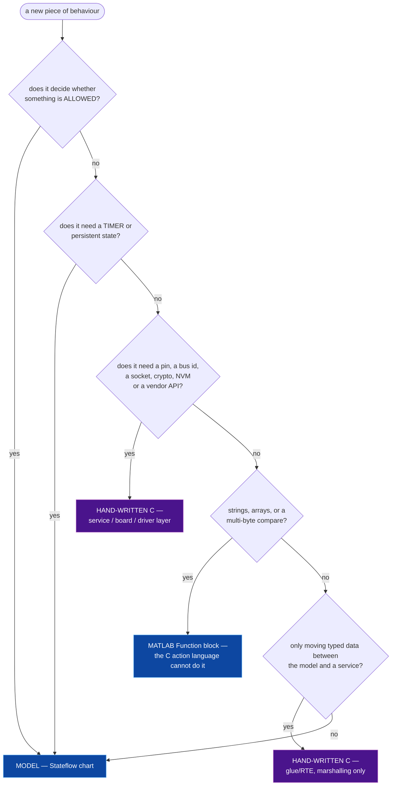

# Model or hand-written code?

Where a new piece of behaviour goes. Decide once, at design time — moving it later is cheap only in
the sense that it changes no behaviour, which is exactly why it never gets prioritised.

---

## The decision rule

---

## The two hard constraints that force the split

**① The C action language rejects `if` inside a state action.** All branching must be transitions
and junctions. The MATLAB action language accepts `if`, but then calls out to hand-written C
functions (a logger, a helper) are unavailable. Most production charts therefore keep the C action
language and push anything needing real expressions into a **MATLAB Function block**.

That is the *only* good reason to add a MATLAB Function block. Adding one because the chart logic
got awkward usually means the chart is modelling the wrong thing — see Rule 3: check whether the
existing mechanism avoids the problem entirely.

**② The glue/RTE layer may only branch on "did this call succeed".** The moment an `if` in the glue
layer changes product behaviour, the logic is in the wrong layer. Timers, retries, debounce,
timeouts and persistence are *stateful mechanism* and belong in the service layer, not in the glue.

---

## What "reuse" looks like in this split

Before allocating anything as new, list what already exists on both sides. A realistic inventory
for a mature embedded model repo:

**Already in the model, reusable unchanged or with one extra port:** a job/RPC handler with slots,
dedupe, ACK and timeout · a response-encoding chart that is the single egress · an inactivity or
power-mode model with a spare "activity" input already wired · a connectivity model with a message
sender · a metrics model · a config/OTA model whose id-stamping pattern is the one to copy.

**Already in C, reusable unchanged:** the payload parser · the response payload generator · the
transport FSM · the event catalogue (often the work is *enabling an existing event*, not adding
one) · the config store with its bounded-array pattern · the metrics counter policy · the GPIO
layer.

Write the inventory down before writing the "new work" list. In practice the new list shrinks by
half.

---

## Allocation table

Produce one row per requirement, and keep it in the design doc:

| Req | Model | C | Notes |
|---|---|---|---|
| … | ♻ reuse `chartX` | — | one extra input port |
| … | ✚ new region in `chartY` | ♻ existing service call | |
| … | — | ✚ new service module | stateful: timer + retry |

Legend: ♻ reuse existing · ✚ new · — nothing needed.

The value of the table is not the allocation — it is that the ♻ column forces Rule 2 to be answered
requirement by requirement, in writing, where a reviewer can disagree with it.
