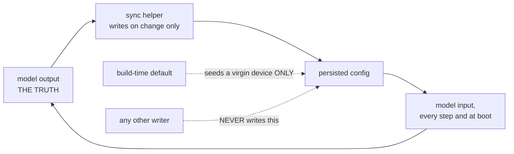

# Rule 1 in full — the dependency analysis

A model that generates code has two halves, and only one of them is type-checked. Everything that
crosses the boundary is a **contract kept by hand** until proven otherwise.

---

## The six questions

Answer all six *in writing* before the first edit. "Probably nothing else uses it" is not an answer.

### 1. Who writes this value?

Search the glue/RTE layer, every chart in every feature model, and any other model that shares the
dictionary. A value can be written by a chart action, a Simulink block, a data store, or the glue
layer between steps.

### 2. Who reads it?

Same three places, plus the top-model wiring. Remember that reads happen *after* the step too —
the glue layer acting on model outputs is a reader.

### 3. Is the name duplicated?

Typical duplication sites for one logical constant:

- the shared data dictionary
- a second, feature-specific data dictionary
- a hand-written enum in the C headers
- a parser key table or a protocol descriptor
- a test harness that hard-codes the value

A rename touches all of them or none of them. A renumber that touches four of five is worse than no
change at all.

### 4. Does a port count change?

If yes: **re-verify every connection to the affected block by name.** Simulink re-attaches lines to
a model-reference block by position. Nothing warns.

### 5. Does it need a new generated file?

Code generation can emit new shared-utility files (`isequal_*.c`, `rt_*.c`, look-up helpers).
Hand-maintained build lists — `CMakeLists.txt`, makefiles, project files — do not learn about them.
A missing entry fails at link time with a message that names the symbol, not the cause.

Conversely, a **stale** generated file that nothing references any more still gets swept into the
build by any "copy all `.c`" step. Delete orphans on both sides.

### 6. Is this value persisted?

If it goes to NVM, flash config or a cloud-visible schema, then changing it is a migration, not an
edit. Check: the schema version, the default for a virgin device, and what happens to devices
already in the field carrying the old value.

---

## The hand-synced contract table

Fill this in for your own project. The point is the last column: what enforcement exists, honestly.

| Contract | Enforced by |
|---|---|
| structs and buses generated from the dictionary | codegen — **safe** |
| imported types the model declares but does not own | **nothing — hand-synced** |
| enum numbering shared between dictionaries and a hand-written enum | **nothing — hand-synced** |
| called C functions the model invokes | link time — fails loudly, late |
| a protocol/topic version string baked into a payload | **nothing — hand-synced** |
| NVM key names and their value schema | **nothing — hand-synced** |

Anything in a **hand-synced** row must be changed in all its places within one commit, and the
commit message should name them.

---

## Directional contracts

Where a value is mirrored — model → config → back into the model as feedback — write down which
side is **the truth** and draw it.

Two failure modes this prevents: a second writer that fights the model for ownership, and a
build-time default that quietly overwrites a field device's state on every boot.

---

## Bit-index and offset conventions: read, never infer

If the model packs flags into a word — a Bit Concatenate, a mask, a shift — **read the actual block
or the actual C** to learn the index convention. Do not infer it from a neighbouring feature, and
do not trust a simulation that agrees with you: if your harness drives the mask itself, it is using
the same assumption as the model and will always agree.

> **Failure mode.** A 64-input Bit Concatenate means input port *k* carries bit *64 − k*. A feature
> assumed the naive mapping and every command on hardware was decoded as the neighbouring command —
> a LOCK executed as an IGNITION-OFF. Simulation passed 48/48.
