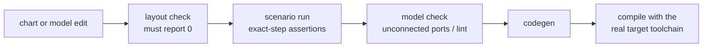

# Rule 5 in full — the verification loop

Run the whole loop after **every** edit, not once per feature. The order is deliberate: the cheapest
check that can fail is first.

| Step | What it catches | Typical cost |
|---|---|---|
| layout check | Rule 4 regressions, chart-owned arcs | seconds |
| scenario run | wrong guard, wrong order, unreachable arc, timing | tens of seconds |
| model check | unconnected ports, dangling lines, chart lint | seconds |
| codegen | type and dictionary problems | a minute |
| target compile | missing build-list entry, header drift, `-Werror` | a minute |

---

## The scratch harness

Do not test the production model directly, and do not modify it to make it testable.

**Build a scratch copy** in a temp directory, from the production model, on every run:

1. Copy the `.slx` to `tempdir`. Never edit the original.
2. If the model uses a **configuration reference**, detach it and attach a standalone copy —
   most test frameworks cannot set parameters through a config reference.
3. Clear machine-specific settings (custom include paths, external tool paths) so the log stays
   readable.
4. Add a **test-friendly interface** where the framework has limits — e.g. harnesses commonly
   cannot resolve enum-typed bus elements, so drive an integer inport and let the scratch model
   convert. Add these ports to the *scratch copy only*.
5. Support a source-model override (an environment/workspace variable) so the same harness can test
   a variant model without editing the script.

This gives a harness that is rebuilt from truth every time, and a production model that never
carries test scaffolding.

## What to assert

**Exact steps, not "eventually".** `output == X at step N` catches ordering and one-step-late bugs
that a settle-and-check assertion hides. Most model defects are off-by-one-step defects.

**Drive inputs the way the real system drives them.** If the production glue layer presents a value
as a one-step pulse, the harness pulses it; if it presents a level that stands, the harness holds
it. A harness that is more generous than reality proves nothing.

**Write the scenario table before the code.** One row per behaviour, with the expectation stated as
an observable:

| Scenario | Expect |
|---|---|
| command while the interlock is active | exactly one rejection, with reason = INTERLOCK |
| two commands 0.9 s apart, rate limit is 1 s | 2nd rejected TOO_FAST; a *status* request in the same window still answers |
| command, then the same command again two steps later | both answered; the 2nd rejected **by the model**, never silently dropped upstream |
| sensor invalid | fail safe — the interlock engages, not disengages |
| state change | event once, metric once, next snapshot shows the new state; a retry adds neither |

The middle rows are the ones that find bugs: they distinguish *rejected for the right reason* from
*silently lost*.

---

## What a harness cannot prove

**An assumption it shares with the model.** If the harness computes a bit index, a mask, a scaling
or an offset the same way the model does, it agrees with itself and passes while hardware fails.
Anything of that kind must be **read out of the actual block or the actual C**, and the harness
should carry a comment saying where it was read from.

**Anything it stubs.** A stubbed transport, device or clock proves the model's arithmetic, not the
system's behaviour. Keep the list of stubs visible in the harness header.

**Geometry.** Simulation is indifferent to an unreadable diagram. That is what the layout check is
for.

---

## After codegen

- Sweep generated files with an explicit, *scoped* file list. A repo-root `**/*.c` sweep will
  eventually pull in third-party C from dependency directories.
- Delete **orphan** generated helpers that nothing references any more — they get swept in and
  compiled forever otherwise.
- Verify the copy **actually landed**: check that a field you just added is present in the
  destination header before building. Copy helpers that print success without checking a status
  code are common.
- Add any new generated shared utility to the hand-maintained build list.
